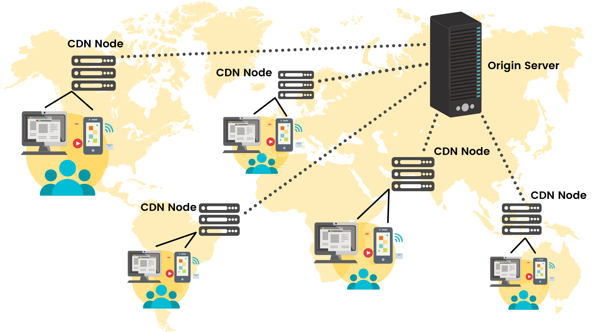

# Netflix Backend-APIs-Clone

In this Project i studied about "System Design of Netflix" and created a clone of Netflix APIs that how Netflix APIs Works

### REQUIREMENTS:-

NodsJs
MongoDB

### Instructions To Run:-

- Install all the required software
- Open Terminal or CMD in the Netflix Backend-APIs-Clone folder and run
  npm install (if you have not installed all the dependencies)
  npm run seed:media
  npm run seed:lib
  npm run start

## Below what i Studied about "System Design of Netflix"

This project focuses on building APIs that will allow developers to interact with Netflix's content library. To better understand the system design of Netflix, let's go over some important concepts.

### What is Netflix?

Netflix is a streaming service that allows users to watch TV shows, movies, and documentaries on various devices. Netflix's content library includes a wide range of genres and languages, and the service is available in over 190 countries. Netflix has a huge user base, and as of 2021, it had over 200 million subscribers.

### How does Netflix manage to have low latency?

Netflix uses a content delivery network (CDN) to ensure that its content is delivered to users with low latency. A CDN is a distributed network of servers that are located in different geographic locations. When a user requests content from Netflix, the CDN identifies the server that is closest to the user's location and delivers the content from that server. This helps to minimize latency and improve the overall streaming experience.

### Dynamic content and static content

Dynamic content refers to content that is generated dynamically in real-time, such as the Netflix homepage, which is customized based on a user's viewing history and preferences. Static content, on the other hand, refers to content that is pre-generated and stored on a server, such as the video files that users stream.

### Video on Netflix is static content and home page is dynamic content

When a user streams a video on Netflix, they are accessing static content that is stored on Netflix's servers. The home page, on the other hand, is dynamic content that is generated based on the user's preferences and viewing history.

### Netflix uses a CDN for its content delivery

Netflix has all its movies on original servers, and they make use of a CDN provided by their cloud provider. Netflix is completely hosted on AWS for all their needs, except for the CDN, which is basically hosted by a company called Open Connect.

### What does Open Connect provide Netflix?

Open Connect is a content delivery network that is specifically designed for video streaming. Open Connect provides Netflix with a dedicated network of servers that are located in strategic locations around the world. This allows Netflix to deliver its content with low latency and high quality.

### How does Netflix offer multiple video resolutions?

Netflix uses video encoding and transport to offer multiple video resolutions. Video encoding refers to the process of converting a video file into a format that can be streamed over the internet. Transport refers to the method used to transmit the video file from Netflix's servers to the user's device. Netflix uses adaptive bitrate streaming, which allows the video quality to be adjusted based on the user's internet connection speed.

### Netflix recommendation overview

Netflix has a sophisticated recommendation engine that suggests content to users based on their viewing history and preferences. The recommendation engine uses a combination of collaborative filtering and content-based filtering.

### Collaborative filtering

Collaborative filtering is a technique that uses the behavior of similar users to make recommendations. For example, if two users have similar viewing histories and one of them has watched a movie that the other has not, the recommendation engine will suggest that movie to the user who has not seen it.

### Content-based filtering

Content-based filtering is a technique that recommends content based on the characteristics of the content itself. For example, if a user has watched several romantic comedies, the recommendation engine may suggest other romantic comedies based on the genre and other characteristics of the movies.

In conclusion, Netflix has a complex system design that involves the use of a CDN, video encoding, and sophisticated recommendation engines. By using these techniques, Netflix is able to deliver high-quality video content with low latency and provide a personalized viewing experience to its users.
